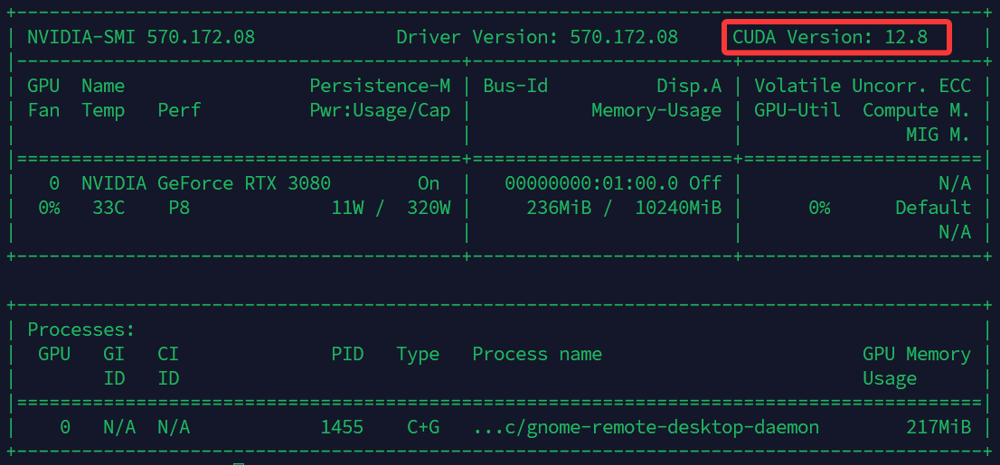

# liteRT Kotlin部署
[简体中文](README.md) / [English](docs/README_EN.md)

## liteRT简介
LiteRT（Lite Runtime的缩写），前身为 TensorFlow Lite，是谷歌推出的高性能设备端 AI 运行环境：
- **设备端优化：** TFLite 针对设备端 ML 进行了优化，通过在本地处理数据来减少延迟，通过不传输个人数据来增强隐私，并通过最小化模型大小来节省空间。
- **多平台支持：** TFLite 提供广泛的平台兼容性，支持 Android、iOS、嵌入式 Linux 和微控制器。
- **多样化的语言支持:** TFLite 与各种编程语言兼容，包括 Java、Swift、Objective-C、C++ 和 Python。
- **高性能:** 通过硬件加速（支持CPU，GPU，TPU）和模型优化实现卓越性能。

## 相关链接
[liteRT文档](https://ai.google.dev/edge/litert) \\ [liteRT API](https://ai.google.dev/edge/api) \\ [源码仓库](https://github.com/google-ai-edge/LiteRT) \\ [官方示例](https://github.com/google-ai-edge/litert-samples/tree/main/v2/image_segmentation)

## 流程
### 1.环境准备

系统：Ubuntu（如有GPU加速需求先安装Nvidia驱动）


**（可选）安装CUDA**

- 终端中查看CUDA版本

```shell
$ nvidia-smi
```



- 安装对应版本CUDA[下载&安装指导地址](https://developer.nvidia.com/cuda-toolkit-archive)

- 根据CUDA版本安装cudnn[下载&安装指导地址](https://developer.nvidia.com/cudnn-archive)
  *需要注意cudnn的版本要和cuda对应*

**配置miniconda（方便管理环境）**
- 安装miniconda[下载&安装指导地址](https://www.anaconda.com/docs/getting-started/miniconda/install#linux-2)
- 添加国内镜像[指导地址](https://mirrors.tuna.tsinghua.edu.cn/help/anaconda/)
- 创建模型训练和转换环境（建议python为3.10版本）：
```shell
$ conda create -n yolo python=3.10
```
- 激活环境
```shell
$ conda activate yolo
```

### 2.模型格式转换
> liteRT在边缘端部署时只支持自家的tflite格式，因此需要将别家的模型格式转换成tflite。

**环境部署**

- 安装torch[下载&安装指导地址](https://pytorch.org/get-started/previous-versions/)

**方法一：采用Ultralyrics的开源工具库，适用于Ultralyrics自家的模型  [参考链接](https://docs.ultralytics.com/zh/integrations/tflite/)**
- 安装Ultralyrics
```shell
$ pip install ultralytics
```
- 如果下载过慢可以通过镜像下载：
```shell
$ pip install -i https://mirrors.tuna.tsinghua.edu.cn/pypi/web/simple/ ultralytics
```
- 或者通过设置代理下载：
```shell
$ pip install ultralytics --proxy=http:127.0.0.1:7890
```

- 创建`trans.py`，转换预训练的模型（更多模型可以参考Ultralyrics文档）
```python
from ultralytics import YOLO

# 载入预训练的模型，也可以是本地调参后的模型
model = YOLO("yolo11n.pt")

# 转换为tflite格式
model.export(format="tflite") 

# 载入转换后的模型
tflite_model = YOLO("yolo11n_float32.tflite")

# 测试，运行推理
results = tflite_model("https://ultralytics.com/images/bus.jpg")                                         
```

- 转换后的得到一个新的文件夹：
```
yolo11n_saved_model
├── assets
├── fingerprint.pb
├── metadata.yaml
├── saved_model.pb
├── variables
│   ├── variables.data-00000-of-00001
│   └── variables.index
├── yolo11n_float16.tflite
└── yolo11n_float32.tflite
```
- 其中的`yolo11n_float16.tflite`和`yolo11n_float32.tflite`分别是半精度和单精度的模型，都可以被调用。
  `metadata.yaml`中包含了模型的基本信息：
```yaml
description: Ultralytics YOLO11n model trained on /usr/src/ultralytics/ultralytics/cfg/datasets/coco.yaml
author: Ultralytics
date: '2025-10-14T10:47:03.453225'
version: 8.3.203
license: AGPL-3.0 License (https://ultralytics.com/license)
docs: https://docs.ultralytics.com
stride: 32
task: detect
batch: 1
imgsz:
- 640
- 640
names:
  0: person
  1: bicycle
  2: car
  3: motorcycle
  4: airplane
  5: bus
  6: train
  7: truck
  ...
args:
  batch: 1
  fraction: 1.0
  half: false
  int8: false
  nms: false
channels: 3
```

- 我们后面需要用到的主要有`imgsz`和`names`，分别说明了模型的输入shape和label名。模型的信息还可以通过zip解压tflite文件直接获取json文件:

```json
metadata.json
{
  "description": "Ultralytics YOLO11n model trained on /usr/src/ultralytics/ultralytics/cfg/datasets/coco.yaml",
  "author": "Ultralytics",
  "date": "2025-10-11T11:02:29.194943",
  "version": "8.3.203",
  "license": "AGPL-3.0 License (https://ultralytics.com/license)",
  "docs": "https://docs.ultralytics.com",
  "stride": 32,
  "task": "detect",
  "batch": 1,
  "imgsz": [
    640,
    640
  ],
  "names": {
    "0": "person",
    "1": "bicycle",
    "2": "car",
    "3": "motorcycle",
    "4": "airplane",
    "5": "bus",
    "6": "train",
    "7": "truck",
    ...
  },
  "args": {
    "batch": 1,
    "fraction": 1.0,
    "half": false,
    "int8": false,
    "nms": false
  },
  "channels": 3
}
```

**方法二：通过liteRT官方库转换（待测试）**

### 3.添加依赖
```kts
implementation("com.google.ai.edge.litert:litert:2.0.2")
implementation("com.google.ai.edge.litert:litert-gpu:1.4.0")
implementation("com.google.ai.edge.litert:litert-support:1.4.0")
implementation("com.google.ai.edge.litert:litert-metadata:1.4.0")
```

### 4.初始化模型和标签

- 编写YOLO模型输出的后处理器
```kotlin

import android.content.Context
import android.graphics.RectF
import org.tensorflow.lite.support.common.FileUtil
import java.util.PriorityQueue

data class DetectionResult(
    val boundingBox: RectF,
    val label: String,
    val score: Float
)

fun process(
    context: Context,
    outputArray: FloatArray,
    labels:List<String>
): List<DetectionResult> {

    val CONFIDENCE_THRESHOLD = 0.4f // 置信度阈值
    val NMS_IOU_THRESHOLD = 0.5f   // NMS算法的IoU阈值
    val NUM_BOXES = 8400           // 检测框总数
    val NUM_CLASSES = Detection.labels.size          // 类别总数


    // 解析原始输出并筛选
    val candidateDetections = mutableListOf<DetectionResult>()

    for (i in 0 until NUM_BOXES) {
        // 提取类别分数
        val classScores = FloatArray(NUM_CLASSES)
        for (j in 0 until NUM_CLASSES) {
            classScores[j] = outputArray[(4 + j) * NUM_BOXES + i]
        }

        // 找出分数最高的类别
        var maxScore = -1.0f
        var maxScoreIndex = -1
        classScores.forEachIndexed { index, score ->
            if (score > maxScore) {
                maxScore = score
                maxScoreIndex = index
            }
        }

        // 应用置信度阈值
        if (maxScore > CONFIDENCE_THRESHOLD) {
            // 提取归一化的边界框坐标
            val centerX = outputArray[0 * NUM_BOXES + i]
            val centerY = outputArray[1 * NUM_BOXES + i]
            val width = outputArray[2 * NUM_BOXES + i]
            val height = outputArray[3 * NUM_BOXES + i]

            // 将 center-width-height 格式转换为 left-top-right-bottom 格式
            val left = centerX - width / 2
            val top = centerY - height / 2
            val right = centerX + width / 2
            val bottom = centerY + height / 2

            val boundingBox = RectF(left, top, right, bottom)
            val label = labels[maxScoreIndex]

            candidateDetections.add(
                DetectionResult(boundingBox, label, maxScore)
            )
        }
    }

    // 执行非极大值抑制 (NMS)
    return nonMaxSuppression(candidateDetections, NMS_IOU_THRESHOLD)
}

// 非极大值抑制 (NMS) 算法，用于消除重叠的检测框。
fun nonMaxSuppression(
    detections: List<DetectionResult>,
    iouThreshold: Float
): List<DetectionResult> {
    val finalDetections = mutableListOf<DetectionResult>()
    // 按类别对检测结果进行分组
    val detectionsByLabel = detections.groupBy { it.label }

    for ((_, detectionGroup) in detectionsByLabel) {
        // 使用优先队列按分数降序排序
        val priorityQueue = PriorityQueue<DetectionResult>(detectionGroup.size, compareByDescending { it.score })
        priorityQueue.addAll(detectionGroup)

        while (priorityQueue.isNotEmpty()) {
            // 取出分数最高的检测框
            val bestDetection = priorityQueue.poll() ?: continue
            finalDetections.add(bestDetection)

            // 移除与当前最高分框 IoU 过高的其他框
            val iterator = priorityQueue.iterator()
            while (iterator.hasNext()) {
                val nextDetection = iterator.next()
                val iou = calculateIoU(bestDetection.boundingBox, nextDetection.boundingBox)
                if (iou > iouThreshold) {
                    iterator.remove()
                }
            }
        }
    }
    return finalDetections
}

// 计算两个边界框的交并比 (Intersection over Union, IoU)。
fun calculateIoU(box1: RectF, box2: RectF): Float {
    val xA = maxOf(box1.left, box2.left)
    val yA = maxOf(box1.top, box2.top)
    val xB = minOf(box1.right, box2.right)
    val yB = minOf(box1.bottom, box2.bottom)

    val intersectionArea = maxOf(0f, xB - xA) * maxOf(0f, yB - yA)
    val box1Area = (box1.right - box1.left) * (box1.bottom - box1.top)
    val box2Area = (box2.right - box2.left) * (box2.bottom - box2.top)
    val unionArea = box1Area + box2Area - intersectionArea

    return if (unionArea > 0) intersectionArea / unionArea else 0f
}
```

- 初始化模型

```kotlin

import com.google.ai.edge.litert.Accelerator
import com.google.ai.edge.litert.CompiledModel
import org.tensorflow.lite.DataType
import org.tensorflow.lite.support.common.ops.NormalizeOp
import org.tensorflow.lite.support.image.ImageProcessor
import org.tensorflow.lite.support.image.TensorImage
import org.tensorflow.lite.support.image.ops.ResizeOp
import org.tensorflow.lite.support.image.ops.Rot90Op
import org.json.JSONObject

var modelPath="yolo11n_float32.tflite"
var model =
    CompiledModel.create(
        this,
        modelPath,
        CompiledModel.Options(Accelerator.NPU) //可选CPU或GPU
    )
```

- 初始化标签

```kotlin
val metadataFile = File(labelPath) 
val metadataJsonString = metadataFile.readText(Charsets.UTF_8)

val metadataJson = JSONObject(metadataJsonString)
if (!metadataJson.has("names")) {
    println("错误：metadata.json 文件中不包含 'names' 对象。")
    return
}

val namesObject = metadataJson.getJSONObject("names")
val labels = mutableListOf<String>()

// "names" 对象的键是 "0", "1", "2", ... 我们需要按此顺序提取值
for (i in 0 until namesObject.length()) {
    val key = i.toString()
    if (namesObject.has(key)) {
        labels.add(namesObject.getString(key))
    } else {
        // 如果键不连续，这是一个警告
        println("警告：在 'names' 对象中找不到索引为 '$key' 的标签。")
    }
}
```

- 模型推理

```kotlin
val now= System.nanoTime()

// 载入图片
val tensorImageMaker = TensorImage(DataType.FLOAT32)
val imageFile = File(imagePath)
BitmapFactory.decodeFile(imageFile.absolutePath)
tensorImageMaker.load(bitmap)

//载入图片处理器
val imageProcessor = ImageProcessor.Builder()
    .add(Rot90Op(-1))
    .add(ResizeOp(YOLO_H, YOLO_W, ResizeOp.ResizeMethod.BILINEAR))
    .add(NormalizeOp(0.0f, 255.0f))
    .build()

//处理图片
val processedImg = imageProcessor.process(tensorImageMaker)

//转换格式为模型输入格式
val inputFeature = processedImg.tensorBuffer.floatArray

//开始推理
val inputBuffers = model.createInputBuffers()
val outputBuffers = model.createOutputBuffers()
inputBuffers[0].writeFloat(inputFeature)
model.run(inputBuffers, outputBuffers)
val outputFloatArray = outputBuffers[0].readFloat()
Log.d(
    "YOLO_INFERENCE",
    "Inference successful.}"
)

//后处理
val re = YoloPostProcessor.process(ctx, outputFloatArray)
if(re.size>0){
    val inferFPS= String.format("%.2f",1000.0f/(System.nanoTime()-now)*1000000.0f).toString()
    Log.d(
        "YOLO_INF_FPS", " ${inferFPS}fps"
    )
}

//输出结果
re.forEach { r ->
    Log.d(
        "YOLO_RESULT", "Label: ${r.label}, " +
                "score: ${r.score}, " +
                "Position: ${r.boundingBox}"
    )
}

//关闭模型
inputBuffers.forEach { it.close() }
outputBuffers.forEach { it.close() }
model.close()
```


